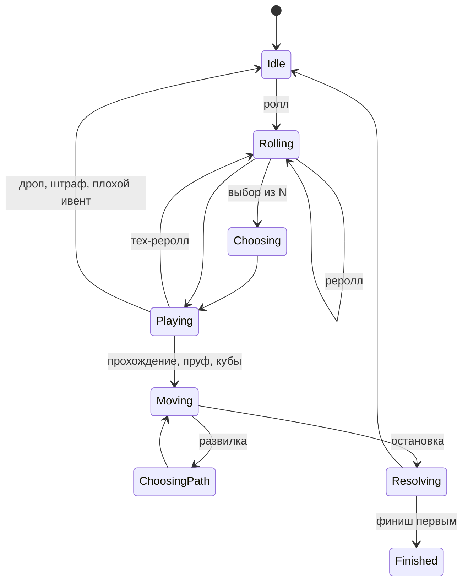
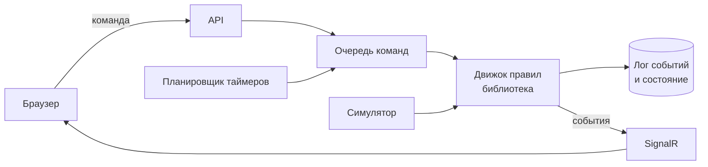

# Игровой ивент — спецификация сайта

Источник истины для разработки. Разделы «Уточнения правил после перепроверки» и «Трудности реализации» обязательны.

## Концепция и принципы

Сайт для дружеского сезонного ивента: игроки роллят игры, за прохождения кидают кубы, набирают очки и идут по карте с зонами, предметами и ивентами. Старые правила из таблицы «Игры крутить» — источник идей, а не ТЗ.

- **Масштаб**: 10–16 игроков, админ добавляет новых в любой момент. Сезон около 3 недель, длительность обсуждается.
- **Игры**: только ПК, эмуляторы допускаются.
- **На совести**: проверки не блокируют игру. Админ подтверждает пруфы позже и может откатить любое действие.
- **Прозрачность**: лог всех действий, включая действия админа, виден всем игрокам.
- **Правила — это данные**: числа, предметы, ивенты, колёса, зоны и карта правятся в админке без изменения кода.
- **Дёшево**: один сервер до 300 ₽ в месяц.
- **Без внешних уведомлений**: никаких ботов в Discord или Telegram, всё происходит на сайте.

## Прогресс и победа

У игрока два независимых показателя: позиция на карте решает первое место, очки решают все остальные.

- **Очки** — сумма кубов за прохождения с учётом модификаторов плюс явные эффекты на очки: клетки-бонусы, бонус финиша, кража очков. Дроп отнимает очки. Броски предметов для перемещения очков не дают.
- **Позиция** — клетка на карте. Кубы за прохождение двигают вперёд на то же число, клетки и предметы могут сдвигать отдельно от очков.
- **Каждый эффект явно указывает, на что действует**: позиция, очки, монетки или несколько сразу.
- **Первое место** — первый, кто дошёл до финиша. Его очки замораживаются, дальше он играет без зачёта и не влияет на остальных.
- **Финиш подтверждается пруфом.** Пока админ не одобрил прохождение, которое довело до финиша, первое место предварительное. В это время игрок уже не влияет на других, но его очки считаются как обычно; заморозка наступает при одобрении. При реджекте игрок откатывается, а место достаётся следующему финишировавшему.
- **Остальные места** — по очкам на момент дедлайна.
- **Финишировавшие не первыми** получают убывающий бонус (например 10 / 8 / 6 / 4 очка, числа в конфиге) и продолжают набирать очки. Их позиция после финиша больше не меняется, бонус выдаётся один раз.
- **Если до финиша никто не дошёл**, все места распределяются по очкам.
- **Тайбрейк**: число пройденных игр, затем кто раньше набрал итоговые очки.
- **Дедлайн**: засчитывается бросок кубов, сделанный до дедлайна, пруф можно догрузить позже. Недопройденная игра не засчитывается. Итоги объявляются только после проверки всех пруфов.
- **Лидерборд** показывает обе метрики: очки и клетки до финиша.
- **Длина карты** подбирается так, чтобы до финиша доходил только самый активный игрок и ближе к концу сезона. Иначе одно из условий победы никогда не сработает. Проверяется симуляцией.

## Игровой цикл

Ход игрока — строгая машина состояний: у игрока всегда одно активное прохождение и один понятный следующий шаг.

Любой выбор (игра из нескольких, ветка на развилке, цель предмета, исход рискованной карты) — одно общее состояние «ожидание выбора». Сервер хранит его, поэтому закрытая вкладка ничего не ломает.

- **Одно активное прохождение** на игрока. Лимит лежит в конфиге, чтобы потом можно было разрешить больше.
- **Финишировавший первым** проходит тот же цикл в свободном режиме: без очков, монеток и влияния на других.
- **Финишировавшие не первыми** продолжают обычный цикл, но фаза движения для них пропускается.

## Пул игр и ролл

Игра роллится в два шага: колесо категорий с весами, затем случайная игра с выпавшим тегом из общего пула с учётом фильтров.

- **Пул общий**: у игры есть теги, заметка (челлендж или условие прохождения для бесконечных игр) и автор. Игроки добавляют игры сами, админ правит и удаляет.
- **Дубли**: при добавлении сайт предупреждает о похожих названиях, например «Dice Fold» и «Dice & Fold».
- **Удаление мягкое**: удалённая игра пропадает из роллов, но прохождения её сохраняют.
- **Длина игры** берётся из HowLongToBeat (основной сюжет) и фиксируется в прохождении при ролле. Если данных нет — лонгплеи на YouTube или обзоры Steam. Админ может поправить.
- **Фильтры ролла** по приоритету: спецролл или эффект, затем зона карты, затем обычный ролл. Если фильтры пересекаются в пустоту, срабатывает более приоритетный.
- **Колесо — только анимация.** Результат определяет сервер в момент клика, обновление страницы ничего не меняет.
- **Мультиплеерные игры** без соло-режима: условие прохождения задаёт админ, результат при необходимости вводит вручную.

### Статусы игры в сезоне

| Ситуация | Что видит игрок | Что происходит |
| --- | --- | --- |
| Игру уже прошёл кто-то в сезоне | «Уже прошёл Вася, 12.10» | бесплатный автореролл |
| Игру сейчас играет другой | «Сейчас играет Вася» | бесплатный автореролл |
| Игру дропнул или техдропнул другой | пометка с причиной | можно играть |
| Ты проходил её до ивента | кнопка «Уже проходил» | бесплатный реролл, игра исключается для тебя |
| Ты сам её дропнул или техдропнул | ничего | больше тебе не выпадает |

Двое одну игру одновременно не играют. Кооп — это одно общее прохождение, а не два.

### Реролл, дроп, тех-реролл

- **Реролл до начала**: первый после каждого ролла бесплатный, следующие стоят монеток или плохой ивент.
- **Дроп**: не раньше чем через час игры, на совести. Штраф — кубы за дроп, которые отнимают очки и позицию, плюс обязательный плохой ивент. Монеток за дроп нет.
- **Тех-реролл**: бесплатный, с обязательной причиной: слабый ПК, игра платная и её нет, не запускается, эмулятор не тянет, другое. Доступен 48 часов после ролла, позже только через админа. Админ может превратить тех-реролл в дроп со штрафом.

## Награда за прохождение

Структура награды принята, конкретные числа выставляются после симуляции.

- **Количество кубов** зависит от длины игры, растёт почти линейно и имеет потолок. Цель — примерно одинаковые очки в час для коротких и длинных игр, чтобы дропать длинные было невыгодно.
- **Тип кубика** зависит от сложности, указанной при старте и подтверждённой пруфом:

| Сложность | Кубик |
| --- | --- |
| Лёгкая | d2 |
| Нормальная или сложностей нет | d4 |
| Сложная | d6 |
| Выше сложной | d6 и хороший ивент |

- **Челлендж** из заметки к игре даёт дополнительную награду, например +1 куб или хороший ивент.
- **Пруф**: скрин титров, финальной катсцены или победного экрана, либо прохождение видел другой участник. Кубы кидаются сразу, одобрение админа приходит позже и ход не блокирует.
- **Реджект**: стандартный штраф — снимаются очки и клетки, полученные за это прохождение. Остальные последствия (предметы, ивенты клеток) остаются, при необходимости админ правит вручную.
- **Кооп**: одно общее прохождение с напарником. Бросок один, очки делятся пополам с округлением вверх у того, кто роллил. Каждый двигается на свою половину.
- **Условия от ивентов** («пройди на харде») видны на странице прохождения. Если условие не выполнено, по умолчанию прохождение засчитывается без кубов, но с монетками.
- **Отзыв**: необязательная оценка 1–10 и текст. Виден в ленте, профиле и на странице игры.
- **Монетки** за прохождение начисляются по длине игры, подробнее в «Экономике».

## Экономика и магазин

Валюта одна — монетки. Прямых переводов между игроками нет.

- **Источники**: прохождение (чем длиннее игра, тем больше), челленджи, ивенты, клетки карты. За дроп монеток нет.
- **Траты**: магазин, платные рероллы, возможно откуп от плохого ивента.
- **Минус**: предметы и ивенты могут увести баланс в минус, в минусе покупать нельзя.
- **Переводы**: монетки и предметы переходят от игрока к игроку только через эффекты предметов и ивентов, всё видно в логе.
- **Магазин**: ролл стоит монеток и даёт 3 личных лота на N минут (10–15, в конфиге). Время считает сервер, по истечении лоты исчезают.
- **Реролл магазина** в пределах одной игры каждый раз дороже, цена сбрасывается после прохождения или дропа.
- **Клетка магазина** даёт купон на бесплатный ролл магазина. Купон лежит в инвентаре и используется, когда игрок за компом, поэтому толчок чужим предметом, пока игрок офлайн, ничего не сжигает.
- **Ассортимент** зависит от редкости предметов и может зависеть от зоны.

## Инвентарь: предметы, эффекты, спецроллы

В инвентаре три вида объектов. У каждого есть текстовое описание и, где возможно, автоматический эффект из базовых действий (см. «Архитектуру движка правил»).

| Вид | Как работает |
| --- | --- |
| Предмет | одноразовый, используется вручную в своё окно |
| Эффект | действует сам, пока не выполнится условие или не истечёт срок |
| Спецролл | задаёт, откуда роллить следующую игру; применяются по порядку получения, приоритетные первыми |

- **Гибрид**: для старта 20–30 предметов с автоматикой. Предметы без автоматики применяются вручную теми же базовыми действиями, новые добавляются без кода.
- **Окна использования**: перед роллом, после ролла, перед броском, после броска, в любой момент. Кнопка «Использовать» видна только в подходящее окно.
- **Порядок модификаторов броска**: количество и тип кубиков, затем бросок, затем прибавки, в конце множители. У предмета может быть флаг «не стакается с собой».
- **Срок жизни эффектов**: на N игр или бросков, на время или до срабатывания.
- **Редкость**: обычный, эпический, легендарный. Влияет на шанс выпадения и цену.
- **Лимит инвентаря** задаётся в конфиге.
- **Откуда берутся**: магазин, клетки и лутбоксы, ивенты, награды за челленджи.
- **Кража очков** — самые сильные предметы, потому что очки решают места. Делаем их редкими и дорогими, основную часть атак направляем на позицию и монетки.
- **Никаких предметов, зависящих от онлайна.**
- **Финиш первым и конец сезона**: эффекты обнуляются, инвентарь замораживается. В следующий сезон ничего не переходит.

## Ивенты

Ивенты — карточки в колодах, устроенные так же, как предметы: текст плюс, где возможно, автоматика.

- **Виды**: хорошие, плохие, специвенты, рискованные («кинь d6: 1–3 плохо, 4–6 хорошо»).
- **Откуда**: клетки карты, дроп (плохой обязателен), платный реролл, предметы, сложность выше сложной.
- **Накопление**: ивенты копятся. Если ивент не применим к текущей игре, он ждёт следующей подходящей. Порядок применения: специвент, хороший, плохой.
- **Ивенты-условия** привязываются к следующему прохождению, подробнее в «Награде за прохождение».
- **IRL-ивенты** (караоке, готовка, грим): пруф фото или видео, админ подтверждает, ход не блокируется.
- **Колоды по зонам**: у зоны может быть своя колода.
- **Общие ивенты** запускает админ: длительность, баннер на главной, при необходимости общая цель с прогресс-баром («вместе наиграйте 50 часов»). Финишировавший первым может вносить вклад в кооп-цели.
- **Предложка**: игроки предлагают ивенты, игры и предметы, админ одобряет.

## Взаимодействие игроков

Защита только пассивная: мгновенных ответов на атаки нет, поэтому асинхронность и онлайн не имеют значения.

- **Эффекты от других** применяются только к будущим шагам цели, никогда к уже начатому.
- **Цели**: все, кроме финишировавшего первым. По финишировавшим не первыми работают только эффекты на очки и монетки, их позиция зафиксирована. Случайная цель выбирается только среди активных.
- **Неактивные**: флаг ставит админ вручную. В админке есть подсказка: игроки без действий за N дней с отметкой, есть ли у них активная игра. Долгое прохождение на 100 часов — не повод ставить флаг.
- **Финишировавший первым** не использует предметы на других, не передаёт их и не кидает ивенты на других. Инвентарь заморожен, бить по нему нельзя.
- **Добровольные взаимодействия** (приглашение в кооп, вызов на дуэль): второй игрок принимает или отклоняет, без ответа за N часов приглашение сгорает.
- **Защиты лидера нет.** Админка считает, сколько враждебных эффектов получил каждый игрок. Ограничение «не больше одного враждебного эффекта за раз» лежит в конфиге выключенным и включается без кода.
- **Атаки только на тех, кто выше по очкам** — решаем после симуляции.

## Социальные функции и итоги сезона

Всё здесь строится поверх лога событий и почти не трогает баланс. Исключения — ставки, достижения и челлендж недели: они работают через монетки и конфиг.

### Лента и общение

- **Реакции** на записи ленты, отзывы и моменты галереи: набор из 6 эмодзи в конфиге, по одной реакции каждого вида от человека.
- **Комментарии** к записям ленты и отзывам. Свои можно править и удалять, админ может скрыть любой.
- **Галерея моментов**: пруфы и отдельно загруженные смешные скрины с подписью. Фильтры по игроку и сезону, лимит загрузок в день, админ может скрыть.

### Итоги сезона

- **Итоги для каждого** — страница «Твой сезон»: часы, игры, лучшая и худшая оценка, самый удачный и неудачный бросок, сколько раз били тебя и ты. Кнопка «Картинка для чата» собирает карточку прямо в браузере.
- **Номинации.** Автоматические считаются из лога: больше всех часов, больше всех игр, самый невезучий по кубам, больше всех дропов, больше всех атак. Остальные выбираются голосованием: лучший отзыв, игра сезона, самый смешной момент. Список номинаций — в конфиге.
- **Зал славы**: победители всех сезонов, рекорды (самый большой бросок, самая длинная игра, самый быстрый финиш), личная статистика за все сезоны и титулы вроде «Чемпион сезона 2» в профиле. Итоговая таблица сезона сохраняется при закрытии.

### Голосования

- Общий механизм: вопрос, варианты (игроки, игры, категории или текст), кто голосует, анонимно или нет, срок.
- Результат может запускать эффект, например выбранный жанр становится спецроллом лидера.
- Используются для номинаций, общих ивентов и ивентов вида «выберите игру лидеру».
- Один голос на человека. Зрители голосуют, только если это разрешено конфигом.

### Достижения

- Описываются данными: триггер, условие по статистике игрока, награда (значок и монетки).
- Примеры: «три хоррора подряд», «выбросил максимум на всех кубиках», «пережил пять атак», «прошёл игру длиннее 30 часов».
- Работают на тех же триггерах, что эффекты. Бывают сезонные и за всё время.

### Ставки

- Ставка — на то, что выбранный игрок пройдёт своё текущее прохождение до выбранного срока: 1, 3 или 7 дней.
- Ставить можно в первые 24 часа после ролла этого прохождения. На себя и на финишировавшего первым ставить нельзя.
- Монетки уходят в залог системе. Выигрыш — ставка, умноженная на коэффициент, который зависит от того, сколько часов в день нужно играть, чтобы успеть. Проигранные монетки сгорают.
- Лимиты на размер ставки и число открытых ставок — в конфиге. Прямых переводов между игроками по-прежнему нет.
- Реджект пруфа после выплаты отменяет выигрыш.

### Челлендж недели

- Админ задаёт условие и награду, например «пройди игру старше 2005 года» — 10 монеток.
- Условие — фильтр по игре (тег, длина, год выхода) с автопроверкой или текст с ручной проверкой админом.

### Доска «ищу напарника»

- Игрок с кооп-игрой в активном прохождении публикует запрос. Отклик другого игрока создаёт приглашение в кооп.

### Роль «зритель»

- Видит всё публичное, ставит реакции и комментирует, в игре не участвует. Голосует, если это разрешено конфигом.

### Правила на сайте

- Страница правил собирается из текстов и текущего конфига, поэтому цифры на ней всегда настоящие.
- История изменений правил видна игрокам: дата, что поменялось, было и стало.

### Обложки игр

- Обложка и год выхода подтягиваются из Steam или IGDB (открытая база игр) при добавлении игры и хранятся на своём сервере.
- Если найти не удалось, админ загружает обложку вручную. До этого показывается аккуратная заглушка с названием.

## Карта, зоны и редактор

Карта — свободный граф клеток поверх фоновой картинки, ветки на развилках могут быть любой длины.

| Клетка | Когда срабатывает | Что делает |
| --- | --- | --- |
| Пустая | — | ничего |
| Ивент | при остановке | карта из колоды зоны |
| Магазин | при остановке и проходе | купон на бесплатный ролл магазина или скидка |
| Лутбокс | при остановке | предмет из колеса лутбокса |
| Бонус очков | при остановке | +N очков |
| Шорткат или змея | при остановке | перенос на другую клетку, только позиция |
| Развилка | при проходе | выбор ветки |
| Чекпоинт | при проходе | ниже него откинуть нельзя |
| Финиш | стоп-клетка | место или бонус |

- **Цепочки**: после переноса эффект клетки назначения не срабатывает.
- **Движение назад** идёт по собственному пути игрока: сервер хранит историю пройденных клеток.
- **Свой ход через развилку** ставит движение на паузу до выбора ветки.
- **Чужой толчок через развилку** идёт по ветке по умолчанию.
- **Несколько игроков на клетке** просто стоят вместе.
- **Чекпоинт** защищает позицию, но не очки. Штраф за дроп тоже не откидывает ниже чекпоинта.

### Зоны

- **Зона** — область клеток с правилами: фильтр ролла (жанр, тег, длина), модификатор кубов, множитель штрафа за дроп, своя колода ивентов, цены магазина.
- **Зона фиксируется в момент ролла.** Перенос в другую зону посреди игры меняет правила только со следующего ролла.
- **Развилки ведут в разные зоны** — это главный выбор на карте.

### Редактор

- Загрузка фона, клетки кликом, стрелки между клетками, телепорты, выделение зон.
- Черновик и публикация: игроки видят правки только после публикации.
- Проверки перед публикацией:
    - каждая клетка достижима из старта;
    - из каждой клетки достижим финиш;
    - нет циклов из телепортов;
    - у развилки минимум два выхода и ветка по умолчанию;
    - у клеток с несколькими входами задано основное входящее ребро;
    - у зоны в пуле не меньше 15 подходящих игр, иначе предупреждение;
    - клетки, где стоят игроки, не удалены.
- Карта на телефоне: зум и перетаскивание пальцами с первой версии.

## Аккаунты, сезоны, интерфейс и админка

Аккаунты создаёт админ, регистрации нет. Всё, что относится к игре, живёт внутри сезона.

- **Аккаунты**: логин и временный пароль от админа, игрок меняет пароль сам.
- **Роли**: игрок, админ и зритель. У админа, который играет, два аккаунта.
- **Аватарки**: загрузка файла или ссылка на гифку, например с Tenor. Ссылки сервер скачивает и хранит у себя. GIF хранится как есть с лимитом размера, картинки сжимаются.
- **Сезоны**: аккаунты, аватарки и пул игр живут между сезонами. Позиции, очки, монетки, инвентарь, прохождения, карта и правила — внутри сезона. Прошлые сезоны уходят в архив с историей.
- **Новый игрок посреди сезона**: стартовую позицию, очки и монетки выставляет админ.

### Страницы игрока

- Главная: карта, лидерборд, баннер общих ивентов, текущее прохождение.
- Лента событий сезона.
- Профиль: прохождения, отзывы, статистика.
- Страница игры: все прохождения, дропы и отзывы.
- Пул игр с поиском и добавлением.
- Инвентарь и магазин.
- Правила и FAQ из текущего конфига; итоги сезона, зал славы, галерея, голосования.

### Админка

- **Игроки**: создание, роли, флаг неактивности, ручная правка позиции, очков, монеток, инвентаря и статуса хода.
- **Очередь пруфов**: одобрить, отклонить, одобрить без скрина.
- **Лог действий** с откатом.
- **Контент**: игры, теги и веса, предметы, ивенты, колёса и колоды, зоны, редактор карты.
- **Конфиг правил сезона** со всеми числами.
- **Общие ивенты**: запуск, цели, длительность.
- **Статистика**: враждебные эффекты по игрокам, активность, очки в час.
- **Предложка**: модерация.
- **Импорт и экспорт** контента в JSON.

## Архитектура движка правил

Движок правил — отдельная библиотека, а всё игровое содержимое — данные. Новый предмет, ивент, клетка или зона добавляются через админку, новая механика — одним классом в движке.

Все изменения проходят через одну очередь команд, включая таймеры магазина, приглашений и эффектов. При 10–20 игроках это не тормозит и полностью убирает гонки между действиями.

### Принципы

1. **Лог событий — источник истины.** Каждое изменение пишется как событие: кто, что сделал, результат броска. Состояние обновляется в той же транзакции. Из лога получаются лента, история, аудит и откат через компенсирующие события.
2. **Правила — данные.** Все числа лежат в версионированном конфиге сезона. Прохождение фиксирует версию правил и параметры в момент ролла.
3. **Эффекты собираются из базовых действий.** Предмет, ивент, клетка и зона описываются одинаково: триггер, условие, цели, список действий.
4. **Триггеры по фазам хода**: перед роллом, после ролла, завершение, перед броском, после броска, шаг движения, остановка, проход, дроп, тех-реролл, время. Новая механика — это новая подписка на триггер.
5. **Общий механизм выбора.** Любое действие может попросить игрока выбрать: игру из нескольких, ветку, цель, исход карты. Ход ждёт ответа, состояние хранится на сервере.
6. **Броски только на сервере**, результат сохраняется. Генератор случайных чисел подставляется извне, поэтому тесты и симуляция воспроизводимы.
7. **Ресурсы игрока**: очки и монетки — отдельные колонки для лидерборда и запросов, всё остальное — словарь. Новая валюта или счётчик не требуют правки схемы БД.
8. **Колёса и колоды — одна сущность**: взвешенный список записей (категория, игра, предмет, ивент, текст). Колесо категорий, лутбоксы, колоды ивентов, личные колёса — всё это она.
9. **Мягкое удаление контента**: игры и определения предметов не пропадают из истории.
10. **Движок не зависит от веба**: его можно покрыть тестами и запускать в симуляторе без сайта.

### Базовые действия, стартовый набор

| Действие | Параметры |
| --- | --- |
| Сдвиг позиции | цель, ±N или бросок |
| Изменить ресурс | цель, ресурс, ±N или бросок |
| Бросок | кубики, модификаторы |
| Выдать объект | цель, предмет, эффект или спецролл |
| Забрать, украсть, уничтожить объект | цель, фильтр объекта |
| Превратить объект, добавить примечание | объект, результат |
| Вытянуть ивент | колода |
| Крутить колесо | колесо |
| Изменить следующий ролл | фильтр |
| Изменить следующий бросок | этап, значение |
| Перенос | клетка |
| Запросить выбор | варианты |

### Конвейер броска

Этапы идут в фиксированном порядке: количество и тип кубиков, бросок, прибавки, множители, ограничения (минимум и потолок). Каждый модификатор указывает этап и приоритет, поэтому результат однозначен.

### Цели

Селекторы: сам игрок, выбранный игрок, случайный активный, все, лидер по очкам, выше или ниже по очкам. Исключения по умолчанию: финишировавший первым; для случайных целей — неактивные; для эффектов на позицию — финишировавшие.

### Как расширяется

| Что добавить | Как |
| --- | --- |
| Предмет, ивент, колесо, зону | в админке, без кода |
| Клетку с новой комбинацией эффектов | в редакторе, без кода |
| Новую валюту или счётчик | ключ ресурса в конфиге |
| Новое базовое действие | один класс в движке |
| Новую фазу хода или триггер | правка движка, контент не трогается |
| Новое условие победы | правило в конфиге сезона и обработчик |

### Симулятор

Использует тот же движок: боты с разным свободным временем, реальное распределение длин игр из пула, текущий конфиг, тысячи прогонов. Показывает очки в час по длинам игр, выгоду дропа, частоту финиша и разрыв между активными и занятыми игроками.

## Модель данных

Ресурсы игрока, конфиг, параметры эффектов и снапшоты хранятся в JSON-полях, чтобы новые механики не требовали миграций. Всё, по чему фильтруют и сортируют, — обычные колонки. Статусы игры в сезоне (занята, пройдена, дропнута) вычисляются из прохождений, отдельной таблицы для них нет.

| Сущность | Ключевые поля |
| --- | --- |
| User | логин, хэш пароля, имя, аватарка, роли (игрок, админ, зритель), удалён |
| Season | название, статус, старт, дедлайн, версия правил, карта |
| SeasonPlayer | сезон, пользователь, статус (активен, финишировал, неактивен), порядок финиша, клетка, очки, монетки, прочие ресурсы |
| SeasonResult | сезон, итоговые места, очки, номинации — снимок при закрытии |
| PathStep | игрок сезона, номер шага, отрезок, клетка |
| Game | название, теги, часы HLTB, год выхода, обложка, Steam AppID, кооп, заметка, условие прохождения, автор, удалена |
| Category | название, вес |
| PlayerGameExclusion | игрок сезона, игра, причина (проходил до ивента, дроп, тех-реролл) |
| Run | игрок, игра, напарник, статус, даты, снапшот (часы, зона, сложность, формула кубов, условия), кубики по отдельности, очки, монетки |
| Proof | прохождение, файлы, статус, кто проверил, комментарий |
| Review | прохождение, оценка, текст |
| ObjectDefinition | вид (предмет, эффект, спецролл, ивент, достижение), название, редкость, цена, описание, окно, эффект, флаги, удалён |
| InventoryObject | игрок сезона, определение, примечания, срок или остаток использований, статус |
| PlayerAchievement | пользователь, достижение, сезон или всё время, когда получено |
| Wheel, WheelEntry | колесо (вид, владелец); запись (тип, ссылка или текст, вес) |
| ShopOffer | игрок сезона, лоты, истекает, счётчик рероллов |
| Bet | игрок, на кого, прохождение, срок, ставка, коэффициент, статус |
| Map, Cell, Edge, Zone | карта (фон, черновик или опубликована); клетка (координаты, тип, параметры, зона); стрелка (откуда, куда, по умолчанию вперёд, основная назад); зона (правила, колода) |
| GlobalEvent | сезон, определение, начало, конец, цель, прогресс |
| Poll, PollOption, Vote | вопрос, варианты, кто голосует, анонимность, срок, эффект результата; голос |
| WeeklyChallenge | сезон, неделя, условие, награда, выполнившие |
| Interaction | тип (кооп, дуэль), от кого, кому, статус, истекает |
| PartnerRequest | прохождение, автор, статус |
| Reaction | объект, пользователь, эмодзи |
| Comment | объект, автор, текст, скрыт |
| GalleryItem | сезон, автор, файл, подпись, прохождение, скрыт |
| PendingChoice | игрок сезона, вид выбора, варианты, контекст |
| PendingManualEffect | игрок сезона, источник, текст, статус (ждёт, применено, не применимо), комментарий |
| ScheduledTask | тип, срок, ссылка на объект, выполнено |
| GameEvent | сезон, порядковый номер, команда, тип, версия формата, автор, данные, отменено событием |
| Ruleset | версия, конфиг, дата, кто изменил |
| Suggestion | автор, вид, содержимое, статус |
| BugReport | автор, страница, текст, контекст (последние действия, ошибки браузера), скриншот, статус |

У клеток стабильные идентификаторы между черновиком и публикацией, поэтому правка карты посреди сезона не теряет позиции игроков.

## Стек, хостинг, импорт

Один процесс на ASP.NET Core с SQLite на дешёвом VPS — для 10–20 игроков этого хватает с большим запасом.

- **Бэкенд**: ASP.NET Core на .NET 10 (LTS), движок правил отдельным проектом-библиотекой.
- **БД**: SQLite в режиме WAL через EF Core. Бэкап — копия одного файла.
- **Реалтайм**: SignalR, карта и лента обновляются без перезагрузки.
- **Фронтенд**: React и TypeScript, карта — SVG с зумом и перетаскиванием. Собранный фронт раздаёт тот же процесс.
- **Авторизация**: логин и пароль, куки.
- **Файлы** лежат на диске сервера. Скрины конвертируются в WebP с ограничением разрешения, GIF хранятся как есть с лимитом размера.
- **Хостинг**: российский VPS на 1 ядро и 1 ГБ памяти, до 300 ₽ в месяц; Docker Compose, Caddy для HTTPS. Экономный режим памяти: .NET с настройками экономии памяти, файл подкачки на 1–2 ГБ, тестовая копия запускается только на время проверки. Домен — поддомен на уже имеющемся домене.
- **Бэкапы**: ежедневно база и файлы копируются за пределы сервера.
- **Время** хранится в UTC, дедлайны показываются по Москве с явной подписью.
- **HowLongToBeat**: у сервиса только неофициальный API, поэтому часы подтягиваются по возможности, с ручным вводом как запасным вариантом.
- **Импорт**: одноразовый скрипт из таблицы «Игры крутить» — 606 игр с тегами, заметками и авторами, 14 категорий с весами. Старые 514 предметов и ивенты — база идей для нового контента, а не прямой импорт.

## Эксплуатация и обновления

Сайт должен спокойно обновляться посреди сезона и быстро восстанавливаться после сбоя.

### Обновления и данные

- **Обновления посреди сезона**: перед деплоем автоматически делается бэкап, миграции БД сначала прогоняются на копии боевой базы. У каждой миграции есть проверенный откат или план восстановления из бэкапа.
- **Тестовая копия сайта** на том же сервере, со своей базой и демо-сезоном. Каждое обновление сначала выкатывается туда и только потом на боевой.
- **Режим обслуживания**: на время деплоя и миграций сайт показывает баннер и работает только на чтение.
- **Флаги функций**: новые механики выкатываются выключенными в конфиге сезона и включаются админом. Каждое изменение конфига попадает в историю правил.
- **Совместимость лога**: события не переписываются. При изменении формата события у него появляется версия и преобразование при чтении.
- **Экспорт и импорт сезона**: сезон выгружается одним архивом (лог, состояние, по желанию файлы) и загружается в локальную или тестовую копию. Баги воспроизводятся на реальных данных.
- **Проверка восстановления**: раз в неделю последний бэкап автоматически разворачивается во временную базу и проходит проверку целостности.
- **Контент как файлы**: предметы, ивенты, колёса и зоны хранятся JSON-файлами в репозитории и загружаются в сезон. Правки из админки выгружаются обратно в файлы и коммитятся.

### Поддержка сезона

- **Кнопка «Сообщить о баге»** на каждой странице. К описанию автоматически прикладываются страница, пользователь, последние действия, ошибки браузера и скриншот. Отчёты видны в админке и выгружаются файлом для агента.
- **Наблюдаемость**: структурные логи в файл с ротацией, страница «Ошибки» в админке (последние исключения с запросом и пользователем), эндпоинт проверки здоровья `/health`.
- **Сценарии для ручной проверки**: в тестовой копии админ одной кнопкой загружает готовые ситуации: «финиш на носу», «дедлайн через час», «на игроке пять эффектов».
- **Просмотр глазами игрока**: админ открывает сайт как конкретный игрок в режиме только чтения, это пишется в лог.
- **Сезон по образцу**: новый сезон создаётся копированием правил, карты и контента прошлого.
- **«Что нового»**: страница изменений сайта для игроков собирается автоматически из коммитов.

### Разработка

- **Контракт API**: описание OpenAPI генерируется из бэкенда, типизированный клиент фронтенда — из описания. Расхождение ловится сборкой.
- **Инструкция по эксплуатации** (`RUNBOOK.md`): развернуть с нуля, обновить, откатить, восстановить из бэкапа, начать и закрыть сезон, добавить игрока посреди сезона, сбросить пароль, что делать, если сервер упал.
- **Демо-сезон**: сид с 16 игроками, всем пулом и сотнями событий во всех состояниях — для проверки дизайна и скорости на реальных объёмах.

### CI/CD

- **На каждый push** в GitHub Actions: сборка, анализаторы, архитектурные тесты, быстрые тесты .NET и фронтенда, короткий прогон инвариантов, проверка сгенерированного клиента API, gitleaks. Параллельные прогоны одной ветки отменяются, изменения только в документах пропускают тяжёлые шаги.
- **Перед слиянием в `main`**: плюс E2E на демо-сезоне и проверка миграций на копии базы прошлого релиза.
- **Ночью, если были коммиты**: длинный прогон инвариантов. Раз в неделю — мутационное тестирование.
- **Тестовая копия обновляется автоматически** после зелёного `main`: образ собирается один раз и передаётся на сервер по SSH без реестра образов, затем миграции, запуск и дымовые тесты Playwright. Если дымовые тесты упали, тестовая копия автоматически откатывается на прошлую версию.
- **Боевой сайт обновляется кнопкой** — ручным запуском workflow в GitHub, в том числе с телефона, и только той версией, что прошла тестовую копию. Шаги: бэкап с копией за пределы сервера, режим обслуживания, миграции, запуск, проверка `/health` и дымовые тесты только на чтение, выход из режима обслуживания.
- **Автооткат**: если проверка после выкладки не прошла, сайт возвращается на прошлый образ. Если миграция несовместима, база восстанавливается из бэкапа, сделанного секунды назад; из-за режима обслуживания данные не теряются.
- **Версии**: тег на каждый боевой релиз, заметки из коммитов идут на страницу «Что нового», после обновления игроки видят ненавязчивый баннер.
- **Секреты** хранятся в GitHub Secrets: SSH-ключ отдельного пользователя деплоя с правами только на папку сайта и закреплённый ключ сервера.
- **Мониторинг доступности**: внешний бесплатный сервис раз в 5 минут проверяет `/health` и пишет админу на почту, если сайт лёг.

### Во время сезона

- **Заморозка**: в `main` попадают только исправления, контент и новые механики за выключенными флагами.
- **Миграции только расширяющие**: во время сезона можно добавлять таблицы и колонки, но не удалять и не переименовывать. Удаление — только между сезонами. Так любую версию можно откатить без потери данных.
- **Выкладка ночью**, когда никто не играет. Режим обслуживания длится около минуты.
- **Срочный баг**: тест, воспроизводящий баг, → исправление → тестовая копия → боевой сайт. При необходимости сезон выгружается и баг воспроизводится локально на реальных данных.

### Перед первым сезоном

- **Бета-сезон** на тестовой копии: 3–5 дней с 2–3 друзьями по настоящим правилам. Все отчёты с кнопки бага разбираются до старта.
- **Чек-лист подготовки**: контент и конфиг проверены, страница правил вычитана, аккаунты созданы и пароли розданы, аватарки загружены, дедлайн и часовой пояс выставлены, флаги функций в нужном состоянии, бэкап и восстановление проверены, тестовая копия на той же версии, что боевой сайт, админка работает с телефона, мониторинг доступности включён.

## Этапы разработки

Каждый этап заканчивается рабочей версией. Уже после первого можно провести сезон.

| Этап | Что входит | Результат |
| --- | --- | --- |
| 1. Фундамент | движок-библиотека, лог событий, очередь команд, аккаунты и роль зрителя, сезоны, пул, импорт и обложки, колесо категорий, прохождение с пруфом и отзывом, кубы, дроп, тех-реролл, финиш и места, лента, правила из конфига, базовая админка, наблюдаемость, демо-сезон, тестовая копия, режим обслуживания, экспорт и импорт сезона, кнопка бага, сценарии для ручной проверки | сезон на простой линейной карте |
| 2. Карта | граф, редактор, развилки, телепорты, чекпоинты, зоны, зум на телефоне | полноценная карта |
| 3. Симулятор | боты на том же движке, отчёты по балансу | числа для конфига |
| 4. Экономика и инвентарь | монетки, магазин с таймером, базовые действия, предметы, эффекты, спецроллы, ставки, контент как файлы | первые 20–30 предметов |
| 5. Ивенты | колоды, условия, общие ивенты, голосования, IRL-пруфы, кооп и дуэли, доска «ищу напарника», челлендж недели, предложка | полный игровой цикл |
| 6. Социальное и итоги | реакции и комментарии, галерея моментов, достижения, номинации, итоги сезона, зал славы | атмосфера и память о сезонах |
| 7. Полировка и удобство админа | мобильная вёрстка остальных страниц, анимации, статистика, сезон по образцу, просмотр глазами игрока, «Что нового» | удобство и зрелищность |
| Перед первым сезоном | бета-сезон 3–5 дней на тестовой копии с 2–3 друзьями, разбор отчётов о багах, чек-лист подготовки | уверенный запуск |

## Уточнения правил после перепроверки

Эти правила закрывают логические дыры, найденные при повторной проверке спецификации, и обязательны для реализации.

### Ролл

- **Фильтры — это предикат по играм.** Колесо категорий крутится только по категориям, где под текущими фильтрами есть хотя бы одна доступная игра.
- **Сервер выбирает из доступных игр сразу.** «Уже прошёл Вася» — это показ промаха, а не бесконечный реролл: попадание в занятую игру фиксируется в логе, дальше выбор идёт из оставшихся.
- **Пустой пул**: если под фильтрами не осталось ни одной игры, фильтр зоны снимается; если пусто и без него — админ получает сигнал в админке.
- **Маленькие категории выгорают быстро**, а игры с большим числом тегов выпадают чаще. В админке у каждой категории видно, сколько в ней доступных игр.

### Часы и кубы

- **Часы подтягиваются при добавлении игры в пул**, а не при ролле, чтобы ролл не зависел от HowLongToBeat.
- **Без часов нельзя кинуть кубы.** Если часов нет, игрок вводит оценку со ссылкой на источник, админ может поправить.
- **Каждый кубик хранится отдельно.** Если админ поправил часы после броска, недостающие кубики докидываются, лишние снимаются с конца.
- **Сложность засчитывается по пруфу.** Если игрок понизил сложность посреди игры, считается более низкая. Если админ понизил сложность при одобрении, каждый кубик пересчитывается пропорционально: ⌈значение × новые грани / старые грани⌉, в событии хранятся оба значения.

### Движение

- **Клетки срабатывают при любой остановке**, включая чужой толчок. Исключение — клетка назначения телепорта.
- **Путь игрока хранится отрезками.** Телепорт начинает новый отрезок. Движение назад идёт по пройденным рёбрам. Если отрезок кончился, используется основное входящее ребро клетки. Редактор требует его у клеток с несколькими входами.
- **Назад дальше старта** откинуть нельзя. На финиш можно попасть только ходом за прохождение: если чужой эффект или предмет толкает игрока на финиш, он останавливается на клетке перед финишем.
- **Ход через несколько развилок** за один бросок — это несколько выборов подряд. Оставшиеся шаги хранятся на сервере.
- **Лишние шаги после финиша** сгорают.

### Эффекты

- **Лимит цепочки**: одна команда порождает не больше 3 уровней вложенных эффектов и не больше 50 событий. Дальше цепочка обрывается с записью в лог. Это защита от бесконечных петель вида «толкнул на клетку, которая толкает».
- **Текстовые эффекты без автоматики** попадают в список «ждёт ручного разрешения». Игрок или админ отмечает «применено» или «не применимо» с комментарием.
- **Противоречащие условия** («пройди на лёгкой» и «пройди на харде»): применяется более приоритетное, второе ждёт следующей игры.

### Первое место

- **Финиш прохождения на проверке** поднимается в начало очереди пруфов. Реджект любого прохождения до финиша у финишировавшего пересчитывает его позицию; если он больше не дотягивает до финиша, финиш снимается. Первое место окончательно, когда одобрены все прохождения игрока до финиша включительно.
- **Если первое место освободилось после реджекта**, места и бонусы всех финишировавших пересчитываются по новому порядку. Первым становится следующий финишировавший: его бонус снимается, очки замораживаются в этот момент. Его действия против других за это время остаются, админ правит вручную при необходимости.

### Сезон

- **Статусы сезона**: черновик, идёт, закрытие (дедлайн прошёл, идёт проверка пруфов), завершён, архив. В статусе «закрытие» броски запрещены, пруфы принимаются.
- **Снапшот**: всё, что касается прохождения, фиксируется при ролле. Остальные правила берутся из текущей версии конфига на момент действия.
- **Прогресс общих целей в часах** считается по часам HowLongToBeat пройденных игр, а не по заявленному времени.
- **Лидерборд**: первый финишировавший сверху независимо от очков, дальше по очкам.

## Трудности реализации

Самые рискованные части — редактор карты, универсальность движка эффектов и откат действий. Их лучше упростить сознательно, чем застрять.

| Трудность | Чем грозит | Как обойти |
| --- | --- | --- |
| Редактор карты | самая дорогая часть фронтенда | редактор на React Flow (@xyflow/react, MIT), карта игрока — своё SVG с зумом; этап 1 идёт на линейной карте из конфига |
| Конструктор эффектов в админке | визуальный конструктор съест недели | в MVP эффекты редактируются как JSON со схемой и шаблонами, формы — потом |
| Ручное применение текстовых предметов | сложный интерфейс выбора действий | игроку доступен ограниченный набор действий (сдвиг, монетки, бросок), остальное делает админ; всё в логе |
| Откат действий | поздние команды зависят от отменяемой | откат целой команды через компенсирующие события; если от неё зависят более поздние, админ видит их и откатывает по порядку или правит вручную |
| Расхождение лога и состояния | ошибка в коде тихо портит данные | админская проверка целостности: пересчитать состояние из лога и сравнить с сохранённым |
| Переусложнение движка | движок пишется месяцами | базовых действий не больше 12, новые — только когда их требует конкретный предмет |
| Таймеры и перезапуск сервера | лоты и приглашения не истекают | сроки хранятся в БД, планировщик опрашивает их каждые несколько секунд |
| Тестирование таймеров и дедлайнов | нельзя ждать 3 недели | часы и генератор случайных чисел подставляются извне; в разработке есть «перемотка времени» |
| Параллельные записи в SQLite | блокировки и гонки | все изменения идут одной очередью команд, чтение параллельное в режиме WAL |
| Запросы по JSON-полям | лидерборд и фильтры тормозят или не строятся | всё, по чему фильтруют и сортируют, — обычные колонки; JSON только для параметров и снапшотов |
| Скачивание аватарок по ссылке | сервер можно заставить ходить во внутреннюю сеть | только https, только публичные адреса, белый список доменов (Tenor, Giphy, Klipy), лимит размера |
| Загрузка файлов | вредные файлы и огромные гифки | проверка типа по содержимому, лимиты размера, картинки перекодируются, GIF для карты уменьшается до миниатюры |
| Безопасность входа | подбор паролей, подделка запросов | ограничение попыток входа, куки с SameSite, защита от CSRF |
| HowLongToBeat | неофициальный API ломается | кэш часов в БД, ручной ввод как основной запасной путь, сайт работает без HLTB |
| Импорт из таблицы | дубли, пробелы, разные написания авторов («Абаддон» и «Abaddon») | нормализация названий, отчёт о дублях, ручное сопоставление авторов с аккаунтами |
| Сборка на VPS с 1 ГБ | сборка фронтенда не влезает в память | образы собираются в GitHub Actions, сервер только скачивает готовый образ |
| Бэкапы | потеря сезона при сбое диска | ежедневный бэкап базы и файлов во внешнее хранилище с проверкой восстановления |
| Баланс | симуляция не угадает поведение людей | первый сезон на простых правилах сам станет источником данных для настройки |
| Объём проекта | хобби-проект не доезжает до запуска | этап 1 должен быть готов к реальному сезону без карты-графа, предметов и ивентов |

## Открытые вопросы и проверка на дыры

Основа закрыта, открытыми остаются в основном числа и несколько правил, которые проще решить после симуляции. До решения используются дефолты, указанные в спецификации, через конфиг.

### Решить

- [ ] Все числа баланса: таблица кубов, штрафы за дроп, монетки, цены, бонусы финиша, длина карты — по итогам симуляции.
- [ ] Длительность сезона, сейчас обсуждается 3 недели.
- [ ] Платный реролл: монетки или плохой ивент.
- [ ] Нужен ли откуп от плохого ивента за монетки.
- [ ] Невыполненное условие ивента: подтвердить «без кубов, но с монетками».
- [ ] Фильтр длины игр в последние дни сезона, например за 5 дней — только до 10 часов.
- [ ] Атаки только на тех, кто выше по очкам.
- [ ] Кооп: может ли у напарника быть своё активное прохождение и как делятся монетки.
- [ ] Правила ролла для финишировавших не первыми: своя финишная зона или обычный ролл.
- [ ] Нужны ли личные колёса игроков.
- [ ] Нужны ли дуэли и по каким правилам.
- [ ] Стартовые условия по умолчанию для игрока, добавленного посреди сезона.

### Проверка на дыры

| Дыра | Как закрыта |
| --- | --- |
| Выгодно дропать длинные игры | почти линейные кубы, дроп не раньше часа, штраф бьёт по очкам |
| Тех-реролл вместо дропа | окно 48 часов, причина, админ может сделать дропом |
| Крутить колесо, обновляя страницу | результат решает сервер |
| Копить лоты магазина до поступления денег | лоты живут N минут |
| Подкармливать друга монетками или предметами | прямых переводов нет |
| Финишировавший первым помогает или вредит другим | он заморожен и не влияет на гонку |
| Реджект прохождения, которое довело до финиша | место предварительное до одобрения пруфа |
| Два действия одновременно | единая очередь команд |
| Двое финишировали почти одновременно | порядок по очереди команд |
| Реджект после объявления итогов | итоги только после проверки всех пруфов |
| Правка конфига посреди сезона | снапшот правил в момент ролла |
| Удалили клетку, где стоит игрок | публикация блокируется |
| Цикл из телепортов | проверка редактора, клетка назначения не срабатывает |
| Откат назад через слияние веток | история пути игрока |
| Чужой толчок через развилку | ветка по умолчанию |
| Толчок на клетку магазина, пока игрок офлайн | купон вместо таймера |
| Зона с пустым пулом | предупреждение редактора и приоритет фильтров |
| Двое играют одну игру | игра занята до прохождения или дропа |
| Удалили игру из пула во время прохождения | мягкое удаление, снапшот в прохождении |
| Дубли игр в пуле | предупреждение о похожих названиях |
| Неактивный игрок как случайная цель | ручной флаг неактивности |
| Очки фармятся предметами | очки только за кубы прохождения и явные эффекты |
| Бесплатный дроп в конце сезона | дроп отнимает очки |
| Финишировавшего не первым сталкивают с финиша ради второго бонуса | позиция после финиша фиксирована, бонус один раз |
| Игра не допройдена к дедлайну | не засчитывается, засчитывается бросок до дедлайна |
| Уход в минус по монеткам | в минусе нельзя покупать |
| Бесконечная цепочка эффектов | лимит вложенности и событий на команду |
| Правка часов после броска | кубики хранятся по отдельности, докидываются или снимаются |
| Потеря данных | ежедневный внешний бэкап |
| Ошибка админа | откат и открытый лог |
| Ставка на себя или сговор с дропом | на себя ставить нельзя, ставки только «пройдёт», дроп никому не выгоден |
| Выигрыш ставки по отклонённому пруфу | реджект отменяет выплату |
| Накрутка голосов | один голос на пользователя, зрители по конфигу |
| Спам в галерее и комментариях | лимиты в день, админ скрывает |
| Обновление посреди сезона ломает данные | бэкап перед деплоем, миграции на копии боевой базы, флаги функций |
| Затолкать соперника на финиш чужим предметом | на финиш можно попасть только ходом за прохождение |
